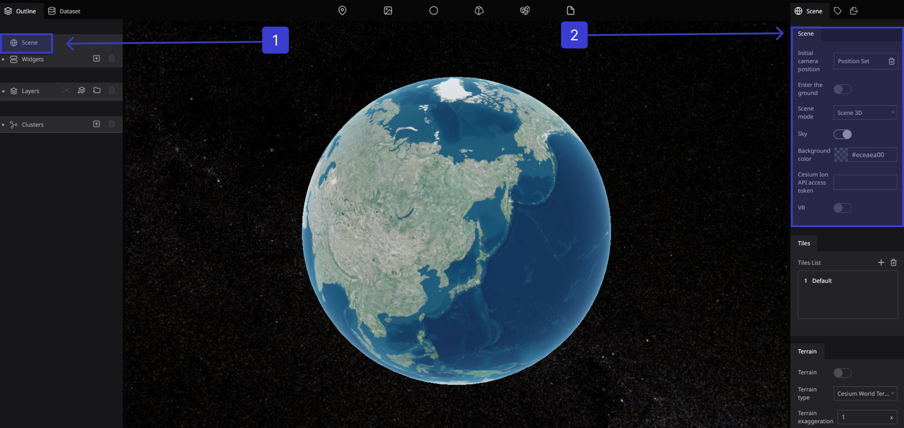
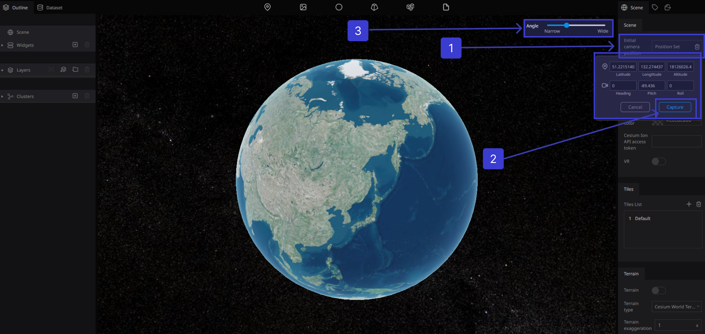
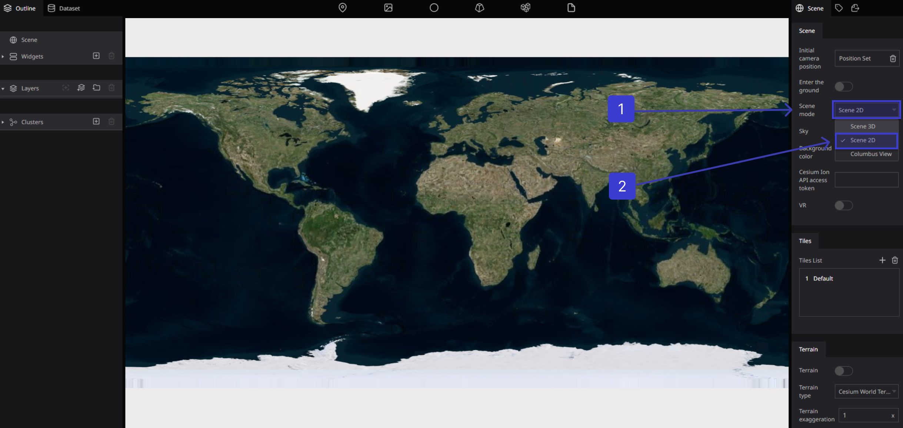
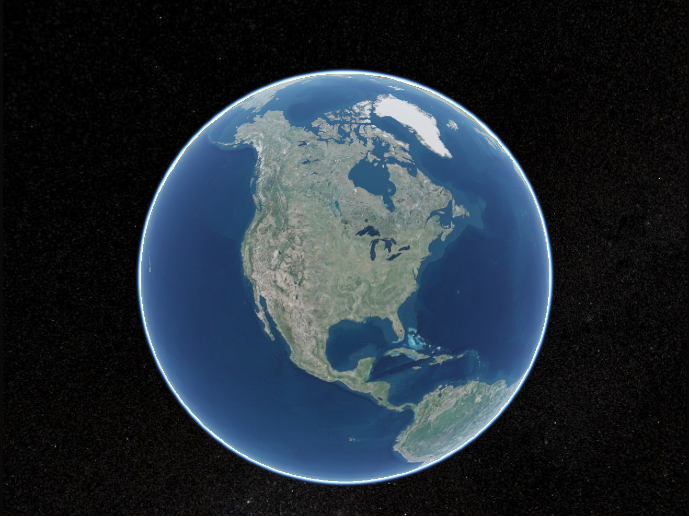
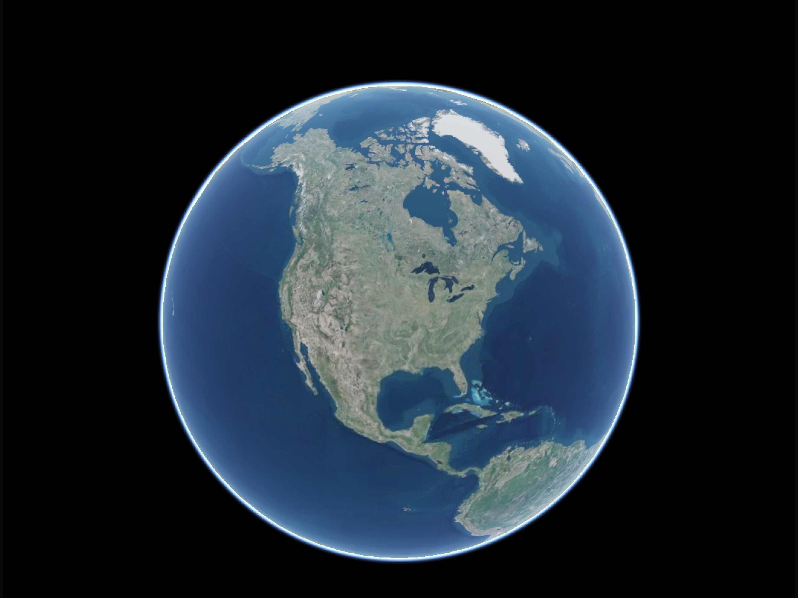
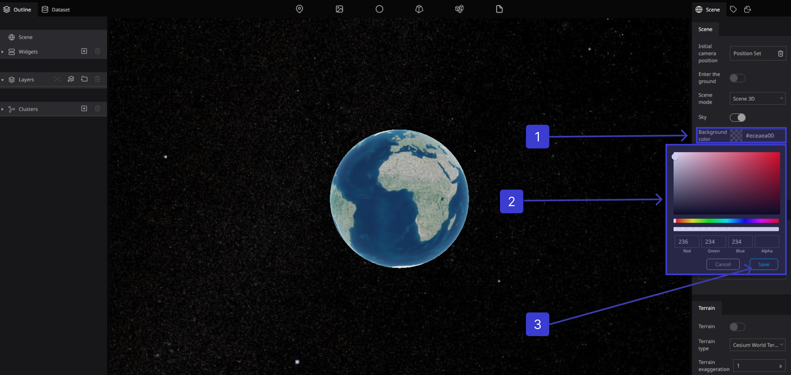
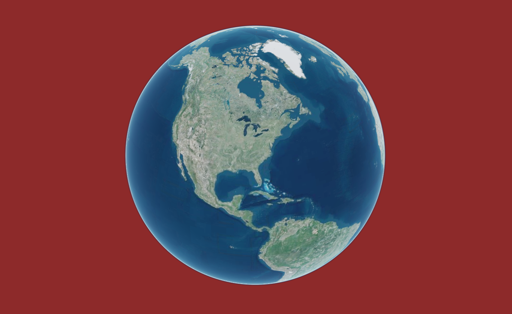

# Scene

## What is Scene?

You can change settings related to the entire project and the digital earth background. The Scene section has nine operable boxes.

This section introduces the functions and effects that can be set in the "Scene" part of the Scene section.

Scene allows you to experience geographic information similarly to the way you would in the real world.

This helps you to understand large and complex data and its spatial relationships by representing it as real-world objects that can be visualized, analyzed and managed in a scene.

## About Scene

The Scene group lets you choose where the camera starts and how outer space looks.

### A. Initial Camera Position

This setting determines the initial viewing angle when the project is opened. By default, the entire North American continent is displayed upon page load.

 
1. When you click 'Initial Camera Position', the viewing angle settings will appear.  You can either directly change the values in the fields or manipulate the map to input the viewing angle.
 
2. Clicking 'Capture' will set the current position and viewing angle as the initial camera position.

 
Clicking the item again allows you to confirm the viewing angle you're setting.
A. Clicking "Jump" will move the camera to the set viewing angle.
B. Clicking "Edit" will allow you to reconfigure the viewing angle.

- Image (New)

 

## B. Enter the Gorund

By turning on the button, you can enter the ground level.

 

### C. Scene Mode 

You can change how the map is displayed. You can choose from "Scene 3D," "Scene 2D," and "Columbus View."

- Scene 3D 
This is the traditional 3D perspective view of the Earth. Working in 3D allows you to incorporate real-world elements into your content by emphasizing the effects of terrain movement and the distinctive 3D sizes of features like trees, buildings, and subsurface geology.

- Scene 2D  
The map is displayed from top to bottom in an orthographic projection. This option allows you to obtain high-quality 2D images at various angles of the location the paper is focusing on.

- Columbus View 
This is a 2.5D perspective view where the map is laid out flat and objects with non-zero height are drawn on top of it. It is like a "bird's-eye view" where you look down at an angle from above. It is also called a panoramic view.

### D. Sky 

'Sky' setting allows you to toggle the display of outer space on or off.

- Enabled

- Disabled

### Background Color Settings

'Background Color' Setting allows you to set the background color when sky display is turned off.

- Disabled the "Sky Setting" and click on "not set" within background colour settings.

- Choose your desired color from the color panel that appears and click "Save".

- Without Background Color

- With Background Color

### F. Cesium Ion API Access Token

We recommend setting a Cesium token when using Cesium, as it allows you to quickly adapt to Cesium version upgrades. Not setting a token will not affect Re:Earth's functionality.

You can obtain the token by logging into Cesium ion and visiting the 'Access Token; page.

### G. VR

**🔥 Caution🔥
This feature is still under development and cannot be used at this time. Please note that turning it on may cause issues such as the globe disappearing.**
